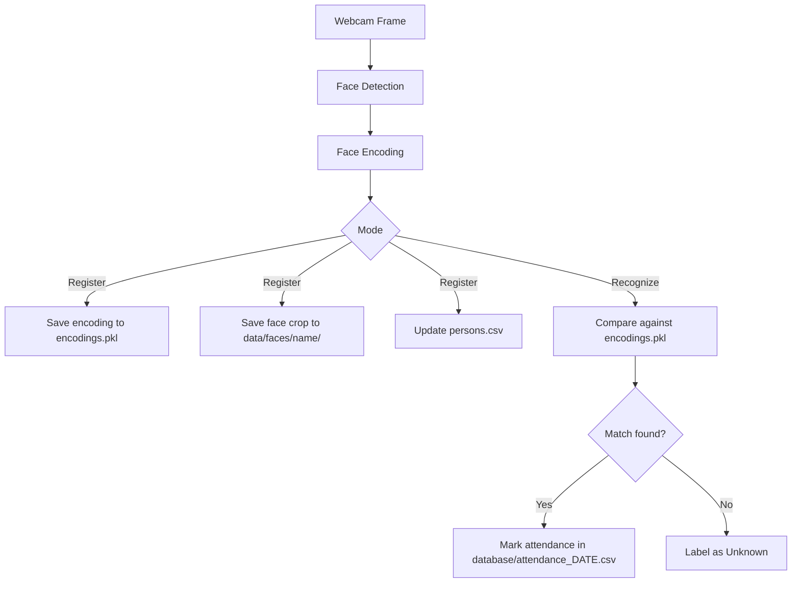
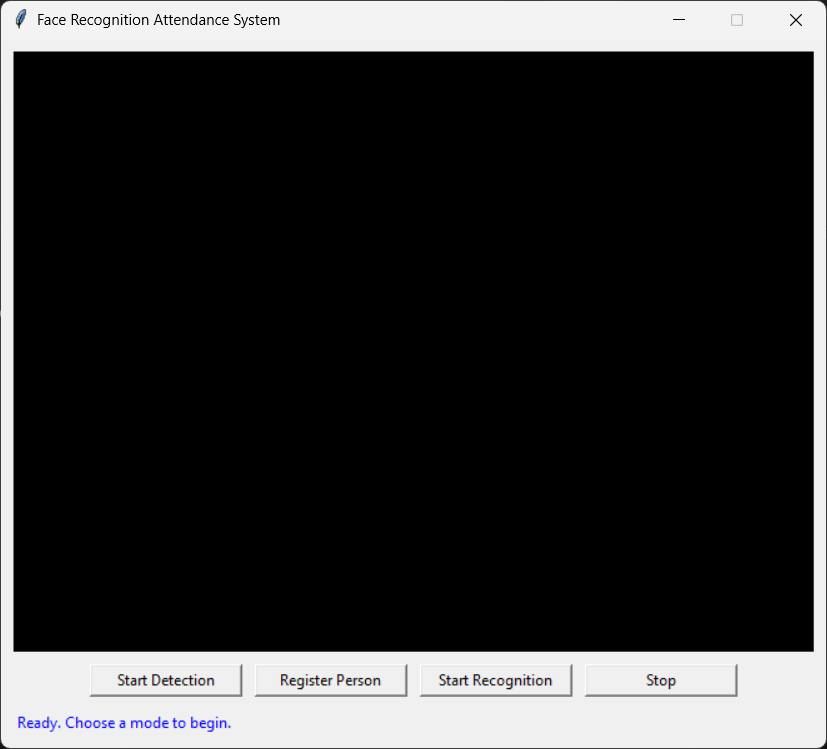
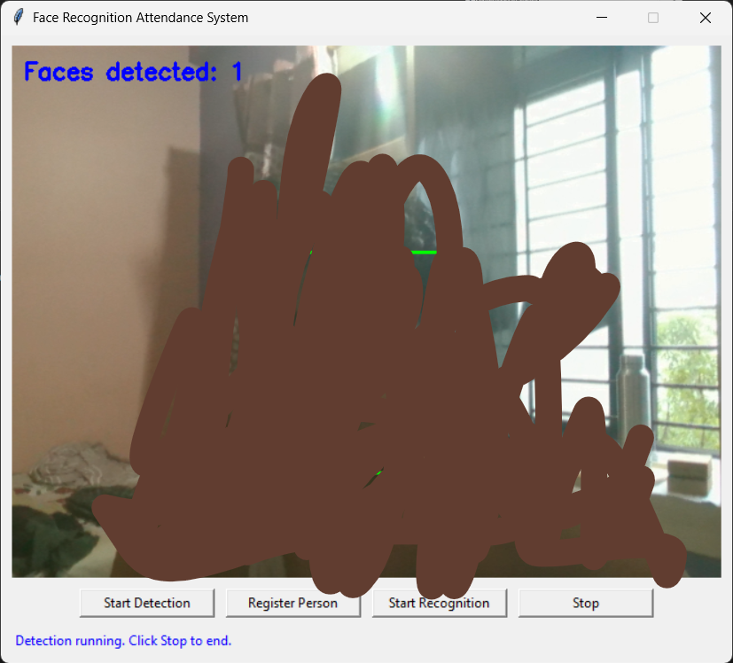

# Face Recognition Attendance System

## Overview

A desktop application that uses a webcam and face recognition to identify registered people and automatically log their attendance. Built as **Project 3 (Face Recognition App)** of the Bright Hub Private Limited AI Internship Program, it replaces manual attendance tracking with a camera-based recognition workflow, wrapped in a simple Tkinter GUI.

## Features

- Real-time face detection (Haar Cascade via OpenCV)
- Face registration with 5 samples per person
- Persistent face encodings (`face_recognition` / dlib)
- Local face-image archive and a human-readable person registry
- Live face recognition with "Unknown" handling for unregistered faces
- Automatic attendance logging with same-day duplicate prevention
- Daily CSV attendance files
- Embedded-webcam Tkinter GUI with Detect / Register / Recognize / Stop modes
- Command-line tools to list and delete registered people
- Performance optimizations to keep the GUI responsive during extended use
- Automated test suite (30 tests)

## Project Objective

Build a working, locally-run face-recognition-based attendance system, covering the full pipeline from face detection through registration, recognition, and attendance logging, as specified by Project 3 of the Bright Hub AI Internship handbook.

## Problem Statement

Manual attendance tracking in classrooms, offices, and events is slow and error-prone. This project automates the process: a person looks at the webcam, the system recognizes them against previously registered faces, and their attendance is recorded automatically, once per day.

## How It Works

1. **Register** a person: the webcam captures 5 valid face samples, each is encoded into a 128-dimensional face embedding, and the embeddings plus the cropped face images are saved locally.
2. **Recognize**: the webcam feed is scanned for faces; each detected face's encoding is compared against all registered encodings, and the closest match under a distance threshold is labeled with that person's name (otherwise "Unknown").
3. **Attendance**: whenever a known person is recognized, their name and a timestamp are appended to that day's CSV attendance file — once per person per day.

## System Architecture



Registration and recognition each use their own detection method: registration and the GUI's live modes use the `face_recognition` library's HOG-based detector for accurate face locations suitable for encoding, while the standalone Phase 1 `face_detection.py` module (and the GUI's "Detect" mode) uses OpenCV's Haar Cascade classifier, which is lighter-weight and only draws bounding boxes.

## Technology Stack

- **Python**
- **OpenCV** (`opencv-python`) — webcam capture, Haar Cascade face detection, image drawing/cropping
- **face_recognition** — face detection (HOG) and 128-d face encoding, built on **dlib**
- **dlib-bin** — prebuilt dlib wheel (see [Windows / dlib Installation Notes](#windows--dlib-installation-notes))
- **NumPy** — array/encoding operations (a `face_recognition` / dlib dependency)
- **Pillow (PIL)** — converting OpenCV frames to Tkinter-displayable images
- **Tkinter** — desktop GUI

> **Note on the technology list:** the internship handbook's Project 3 technology stack additionally lists **Pandas** and **SQLite**. Neither is used by the current implementation — see [Data Storage](#data-storage) and [Limitations](#limitations).

## Project Structure

```text
face-recognition-attendance/
│
├── data/
│   └── faces/
│       ├── persons.csv
│       └── <PersonName>/
│           ├── face_1.jpg
│           ├── face_2.jpg
│           ├── face_3.jpg
│           ├── face_4.jpg
│           └── face_5.jpg
│
├── models/
│   └── encodings.pkl
│
├── database/
│   └── attendance_YYYY-MM-DD.csv
│
├── src/
│   ├── face_detection.py     # Phase 1 – standalone Haar Cascade detection demo
│   ├── face_encoding.py      # Phase 2 – registration, encoding, person registry, CLI
│   ├── recognition.py        # Phase 3 – live recognition
│   ├── attendance.py         # Phase 4 – attendance logging
│   ├── database.py           # currently empty — see Limitations
│   ├── csv_export.py         # currently empty — see Limitations
│   └── gui.py                # Phase 5 – Tkinter GUI wiring the above together
│
├── tests/
│   ├── test_person_registry.py
│   └── test_face_detection_gui_compact.py
│
├── screenshots/
└── README.md
```

`data/`, `models/`, and `database/` are created automatically at runtime as needed.

## Installation

1. Create a virtual environment:

   ```powershell
   python -m venv .venv
   ```

2. Activate it:

   ```powershell
   .venv\Scripts\activate
   ```

3. Install the core dependencies (OpenCV, Pillow, NumPy, and any other non-`dlib` packages your `requirements.txt` lists):

   ```powershell
   pip install -r requirements.txt
   ```

4. Install `face_recognition` and its dlib dependency — see the next section, since this cannot be done with a plain `pip install face_recognition` on this setup.

## Windows / dlib Installation Notes

`face_recognition` depends on `dlib`. On Windows with Python 3.11, installing the canonical `dlib` package from PyPI normally requires compiling it from source (a C++ toolchain and CMake), which is a common source of installation failure.

This project avoids that by using **`dlib-bin` (`dlib-bin==20.0.1`)** instead — a prebuilt, precompiled distribution of the same `dlib` module, published separately from the official `dlib` project on PyPI. It is not the canonical `dlib` package; do not additionally install the regular `dlib` package alongside it, since only one `dlib` module can be importable at a time.

Because `face_recognition` (and `face-recognition-models`) list the canonical `dlib` as a dependency, they must be installed **without** their declared dependencies so pip doesn't try to pull in and build the real `dlib` on top of `dlib-bin`:

```powershell
pip install dlib-bin==20.0.1
pip install --no-deps -r requirements-face-recognition.txt
```

With this setup, `pip check` may report a metadata warning that `face-recognition`'s declared `dlib` dependency is not satisfied (since `dlib-bin` satisfies the same import name but not the declared package name). This is expected and can be disregarded — the `dlib` module imports correctly at runtime because `dlib-bin` provides it.

## Running the Application

### GUI

```powershell
python src/gui.py
```

Opens a window with an embedded webcam preview and four buttons: **Start Detection**, **Register Person**, **Start Recognition**, and **Stop**.

### Registering a Person

Either through the GUI (**Register Person** button, then enter a name when prompted), or from the command line:

```powershell
python src/face_encoding.py
```

You'll be prompted for a name, then the webcam captures 5 valid face samples (one face, clearly visible, per sample). Registration saves:
- the 5 face encodings to `models/encodings.pkl`
- the 5 cropped face images to `data/faces/<Name>/`
- a row for that person in `data/faces/persons.csv`

Re-registering an existing name (after confirming overwrite) replaces all of the above for that person.

### Face Recognition and Attendance

GUI: click **Start Recognition**. Recognized faces are boxed in green with their name; unrecognized faces are boxed in red and labeled "Unknown". The first time a known person is recognized on a given day, their attendance is logged automatically.

Standalone (no GUI):

```powershell
python src/recognition.py
```

### Managing Registered People

All person-registry management is done via `src/face_encoding.py`'s command-line flags — no GUI is provided for listing or deleting people.

### Listing Registered People

```powershell
python src/face_encoding.py --list
```

Prints the names currently in `data/faces/persons.csv`, or `No registered persons found.` if the registry is empty.

### Deleting a Person

```powershell
python src/face_encoding.py --delete PersonName
```

Removes that person's encodings from `models/encodings.pkl`, their folder under `data/faces/`, and their row in `persons.csv`. Their historical attendance records are **not** affected. Deleting a name that isn't registered fails gracefully with a message; it doesn't crash.

## Data Storage

| Path | Contents |
|---|---|
| `models/encodings.pkl` | Pickled dict of `{"names": [...], "encodings": [...]}` — the actual 128-d face encodings used for recognition matching. This is the only file `recognition.py` reads. |
| `data/faces/persons.csv` | Human-readable registry: one row per person (`Name, RegisteredDate, FaceFolder`). Purely for inspection/management — recognition does not read it. |
| `data/faces/<PersonName>/face_1.jpg … face_5.jpg` | The actual cropped face images captured during that person's registration (not full webcam frames). |
| `database/attendance_YYYY-MM-DD.csv` | One CSV file per calendar day, columns `Name, Date, Time`. Created on first attendance mark of that day; a name is written at most once per file. |

All of the above are created automatically as needed and are **not** part of the source repository itself.

## Attendance Records

Each day's attendance lives in its own file, `database/attendance_YYYY-MM-DD.csv`. Before writing a new row, the current day's file is read to check whether the person is already marked present; if so, no duplicate row is written. The GUI additionally keeps an in-memory cache of names already marked today (refreshed from disk when recognition starts) purely to avoid re-reading the CSV on every recognized frame — the CSV file, and its own duplicate check inside `mark_attendance()`, remain the source of truth.

## Privacy and Biometric Data

This application stores biometric data (face images and face encodings) locally on the machine it runs on:

- `data/faces/` contains actual cropped photographs of registered people's faces.
- `models/encodings.pkl` contains the numeric face encodings derived from those photographs.

Both are **local application data** generated at runtime from your own registrations, and both are intentionally excluded from version control via `.gitignore`. Only `.gitkeep` placeholder files are kept in the repository, to preserve the folder structure without committing any biometric data. If you clone this repository, you will need to register your own faces locally — no face images or encodings are distributed with the source code.

## Performance Optimization

An early version of the GUI's Recognize mode ran full face detection and encoding on every displayed video frame (~30 times per second). Since detection and encoding are the most computationally expensive steps in the pipeline, this caused the GUI to progressively slow down and become unresponsive during extended use.

This was addressed with:

- **Recognition frame skipping** — face detection/encoding/matching now runs only every 5th displayed frame (`recognition_frame_interval = 5`), instead of every frame.
- **Reuse of the previous recognition result** on the frames in between, so a bounding box and name are still shown on every displayed frame even though recognition itself isn't re-run that often — video playback stays smooth while the expensive work is throttled.
- **In-memory same-day attendance caching** — the set of people already marked present today is loaded once when recognition starts, avoiding a CSV read on every recognized frame; `mark_attendance()` still performs the authoritative write and duplicate check.
- **Explicit Tkinter `after()` callback cancellation** — when the camera is stopped or a mode changes, the pending scheduled frame update is explicitly cancelled (`root.after_cancel`), preventing stray callbacks from firing against a released camera.

No numerical FPS or latency measurements were collected for these changes; they were verified qualitatively (the GUI no longer freezes during extended recognition sessions) rather than benchmarked.

## Testing

The automated test suite (`tests/`) contains **30 tests**, all passing at time of writing:

- **`test_person_registry.py`** (25 tests) — covers the `data/faces/` storage layer: face-image folder/file creation, `persons.csv` creation and format, re-registration overwrite behavior (no duplicate rows, old folder replaced), listing, deletion (of encodings, face folder, and registry row, including that deleting one person never affects another), name-safety against path traversal (`..`, absolute paths, embedded separators), that `recognition.py` can still load `models/encodings.pkl` independently of the CSV/face-image layer, and that deleting a person never modifies historical attendance CSV files.
- **`test_face_detection_gui_compact.py`** (5 tests) — a compatibility/regression suite confirming `face_detection.py` exposes the API `gui.py` depends on (`load_face_detector`, `detect_faces`, `draw_faces`, `draw_face_count`), that the Haar Cascade loads into a usable `cv2.CascadeClassifier`, that detection/drawing run without error on a blank frame, and that `gui.py` imports successfully end-to-end.

All tests use temporary directories and never touch real registration data or attendance records.

**Not covered by automated tests:** live webcam capture, on-screen video rendering, and end-to-end recognition accuracy against real faces all require physical camera hardware and a display, and were verified manually rather than through the automated suite. Manual testing on an actual machine with a webcam is recommended before relying on this system for real attendance tracking.

## Screenshots

_Add screenshots of the GUI (idle state, Detect mode, Register mode, Recognize mode with a labeled match) to the `screenshots/` folder and reference them here, e.g.:_

```markdown


```

## Limitations

- **No SQLite database.** The handbook's Project 3 technology stack lists SQLite and a "Database Integration" step; the current implementation stores attendance in daily CSV files and registrations in a pickle file plus a CSV registry, with no database engine involved. `src/database.py` and `src/csv_export.py` exist as placeholder files in the project structure but currently contain no code.
- **No formally measured evaluation metrics.** Recognition Accuracy, False Acceptance Rate (FAR), False Rejection Rate (FRR), and Recognition Speed are listed as Project 3 evaluation metrics in the handbook; none of these were formally benchmarked against a labeled test dataset in this implementation.
- **Local, single-machine biometric storage.** Face images and encodings are stored unencrypted on the local filesystem, with no access control beyond the OS's own file permissions.
- **Windows/Python 3.11-specific dependency workaround.** The `dlib-bin` approach documented above is specific to this environment; other platforms or Python versions may need a different `dlib` installation method.
- **Requires a physical webcam.** All detection, registration, and recognition features depend on a locally connected camera; there is no support for uploaded images/video or IP cameras.
- **Single-camera, single-process.** No multi-camera or networked/multi-user support.

## Future Scope

The following are potential future improvements, not currently implemented:

- SQLite (or another database) integration for registrations and/or attendance, as originally suggested by the handbook
- Richer person/student metadata (roll number, department, photo thumbnail, etc.)
- An attendance dashboard or reporting UI beyond raw CSV files
- CSV export/reporting enhancements (`csv_export.py` is currently an empty placeholder)
- A configurable recognition-distance threshold exposed in the GUI
- Formal FAR/FRR/accuracy evaluation against a benchmark dataset
- Measured performance benchmarking (FPS, recognition latency) rather than qualitative assessment
- Multi-camera support
- Encrypted or access-controlled biometric storage
- Role-based administration (e.g. only admins can register/delete people)

## Internship Requirements

This project was built for **Project 3 — Face Recognition App** of the Bright Hub Private Limited AI Internship Program (Artificial Intelligence Internship, Real-World Industry Projects Handbook). The handbook's stated technology stack for this project is Python, OpenCV, the `face_recognition` library, NumPy, Pandas, and SQLite; its listed development steps are Face Detection → Face Encoding → Training Dataset → Recognition → Attendance Logging → Database Integration → GUI Development.

This implementation covers face detection, encoding, recognition, attendance logging, and GUI development from that list. Pandas and SQLite/database integration, and the handbook's listed evaluation metrics (Recognition Accuracy, FAR, FRR, Recognition Speed), are not currently implemented — see [Limitations](#limitations) above.

## License

This project is licensed under the MIT License.