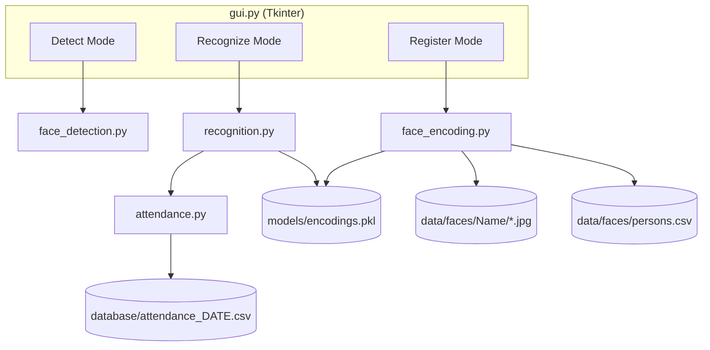

# Face Recognition Attendance System

### Project Report — Artificial Intelligence Internship Program

---

## Acknowledgement

I would like to express my sincere gratitude to Bright Hub Private Limited for the opportunity to participate in their Artificial Intelligence Internship Program and to work on this real-world project. I am thankful to my mentor(s) for their guidance and support throughout the development of this project, and to the LMS support team for their assistance with project-related queries.

I would also like to thank my institution, **[College / Institution]**, for providing the academic foundation that made this internship experience possible, and my family and peers for their continued support and encouragement throughout this internship.

---

## Abstract

Manual attendance-taking in classrooms, offices, and similar settings is time-consuming and susceptible to human error and proxy attendance. This project presents a **Face Recognition Attendance System**, a locally-run desktop application that automates attendance logging using computer vision.

The system uses OpenCV for webcam capture and Haar Cascade-based face detection, and the `face_recognition` library (built on dlib) for HOG-based face detection and 128-dimensional face encoding. During registration, a person's face is sampled five times through the webcam; each sample is encoded and stored, along with the cropped face image itself, in a local, human-inspectable data store. During recognition, faces detected in the live webcam feed are compared against all registered encodings using Euclidean distance; a match below a fixed threshold is labeled with the corresponding person's name, and their attendance is logged to a per-day CSV file, with same-day duplicate prevention.

The application is wrapped in a Tkinter GUI that embeds the live webcam feed and exposes Detect, Register, and Recognize modes, alongside a small command-line interface for listing and deleting registered people. An identified early performance issue — the GUI becoming unresponsive during extended recognition use, because expensive face detection/encoding ran on every displayed frame — was resolved through frame-skipping, in-memory attendance caching, and explicit cancellation of pending GUI callbacks.

The current implementation is tested with a 30-test automated suite covering the registration/registry/deletion logic and detection/GUI-import compatibility, all of which pass. Live webcam behavior, on-screen rendering, and real-world recognition accuracy require physical hardware and were verified manually rather than through automated tests. The system currently stores attendance and registration data in CSV and pickle files rather than a SQLite database, and no formal Recognition Accuracy, False Acceptance Rate, False Rejection Rate, or Recognition Speed measurements have been collected; these are documented as limitations and future scope rather than claimed as achieved results.

---

## Table of Contents

1. Introduction
2. Literature Review
3. Problem Statement
4. Objectives
5. Methodology
6. System Design
7. Implementation
8. Results
9. Conclusion
10. Future Scope
11. References

---

## 1. Introduction

Attendance tracking is a routine but essential task across educational institutions, offices, and other organizations. Traditional methods — roll calls, sign-in sheets, or swipe cards — are slow at scale, easy to falsify (e.g., proxy sign-ins), and generate records that require additional manual effort to compile and report on.

Advances in computer vision and deep-learning-based face recognition have made it practical to automate this process using only a standard webcam: a person's face can be detected, encoded into a compact numerical representation, and matched against previously registered faces in real time, with no specialized hardware.

This project implements such a system as a self-contained, locally-run desktop application, developed as Project 3 ("Face Recognition App") of the Bright Hub Private Limited AI Internship Program. It covers the full pipeline the handbook specifies — face detection, encoding, recognition, attendance logging, and GUI development — using Python, OpenCV, and the `face_recognition` library.

## 2. Literature Review

**Automated attendance systems** have been explored using a range of biometric and non-biometric modalities, including RFID cards, fingerprint scanners, and, increasingly, face recognition, which has the advantage of being contactless and usable with commodity hardware (a standard webcam).

**Face detection** is the task of locating face regions within an image or video frame. Two approaches are used in this project:
- **Haar Cascade classifiers** (Viola & Jones, 2001), a classical machine-learning-based approach using cascaded, boosted classifiers over Haar-like features. OpenCV ships a pretrained frontal-face Haar Cascade, used here for the standalone Phase 1 face-detection module.
- **HOG (Histogram of Oriented Gradients)-based detection**, as implemented internally by the `face_recognition` library (via dlib), used during registration and recognition to obtain face locations suitable for subsequent encoding.

**Face recognition via embeddings**: rather than matching raw pixels, modern systems compute a fixed-length numerical embedding (encoding) of a detected face — typically derived from a deep convolutional network trained so that embeddings of the same person's face are close together in embedding space, and embeddings of different people are far apart. The `face_recognition` library, built on dlib's face recognition model, produces 128-dimensional embeddings; two faces are considered a match if the Euclidean distance between their embeddings falls below a chosen threshold (this project uses the library's commonly used default of 0.6).

**dlib** is a general-purpose C++ toolkit with Python bindings, providing both the HOG-based face detector and the pretrained deep metric learning model used to compute face embeddings; `face_recognition` is a higher-level Python wrapper around dlib's face-related functionality.

**Biometric attendance systems** built on face recognition have seen adoption in schools and workplaces as a faster, harder-to-forge alternative to manual sign-in, though they raise privacy considerations around the storage of biometric data (face images and encodings), which this project addresses by keeping all such data local and excluded from version control (see [Section 7.7](#77-data-storage-and-privacy)).

## 3. Problem Statement

Manual attendance systems are:
- **Time-consuming**, especially for larger groups.
- **Error-prone**, due to manual entry mistakes or omissions.
- **Susceptible to proxy attendance**, where one person signs in on another's behalf.

A face-recognition-based system can address these issues by automatically identifying individuals from a live camera feed and logging their attendance without manual intervention, while keeping the recognized-person data (and the record of who was recognized when) inspectable and locally controlled.

## 4. Objectives

1. Detect faces in a live webcam feed using OpenCV.
2. Register individuals by capturing multiple face samples and generating persistent face encodings.
3. Maintain a human-readable registry of registered people, separate from the raw encoding store, to support inspection and management (listing, deletion) without needing to load or understand the pickle file.
4. Recognize registered individuals in real time from the live webcam feed, and label unregistered faces as "Unknown".
5. Automatically log attendance for recognized individuals, once per person per day.
6. Provide a simple graphical interface that ties the above together, embedding the live video feed directly in the application window.
7. Ensure the system remains responsive during extended use.
8. Establish an automated test suite covering the non-hardware-dependent parts of the system.

## 5. Methodology

### 5.1 Registration Pipeline

```
Camera
  → Face Detection (face_recognition, HOG-based)
  → Face Crop (region extracted from the mirrored BGR frame)
  → Face Encoding (128-d embedding via face_recognition)
  → Encoding Storage (models/encodings.pkl)
  → Face Image Storage (data/faces/<Name>/face_N.jpg)
  → Person Registry (data/faces/persons.csv)
```

For each of 5 required samples, a frame is captured and mirrored; if exactly one face is detected in that frame, its region is both cropped (for local storage as a JPEG) and encoded (for recognition matching). Frames with zero or more than one detected face are skipped for that sample slot, and the user is prompted accordingly (via on-screen text in the CLI flow, or the GUI's status label). Once 5 valid samples have been collected, the encodings are appended to the existing `encodings.pkl` dataset, the 5 face crops are written to a fresh `data/faces/<Name>/` folder (replacing any previous folder for that name), and the person's registry row is added or updated in `persons.csv`.

### 5.2 Recognition Pipeline

```
Camera
  → Frame Processing (mirror, BGR→RGB conversion)
  → Face Detection (face_recognition, HOG-based)
  → Face Encoding (128-d embedding per detected face)
  → Face Distance / Matching (Euclidean distance vs. all known encodings)
  → Known / Unknown (nearest match if distance ≤ 0.6, else "Unknown")
  → Attendance (mark_attendance() for each recognized, non-"Unknown" name)
```

For each detected face in a frame, its distance to every encoding in `models/encodings.pkl` is computed via `face_recognition.face_distance`. The closest (minimum-distance) known encoding is taken as the candidate match; if its distance is at or below the match tolerance (0.6 — `face_recognition`'s commonly used default, unchanged in this implementation), the corresponding registered name is assigned to that face, otherwise it is labeled "Unknown". Every non-"Unknown" name identified in a frame is passed to the attendance-marking logic.

### 5.3 Attendance Pipeline

For each recognized name, `mark_attendance()` checks whether that name is already present in the current day's attendance file (`database/attendance_YYYY-MM-DD.csv`, read fresh from disk); if not, it appends a new row with the name, date, and current time (writing a header row first if the file is being created). This guarantees at most one attendance row per person per day. In the GUI's Recognize mode, an in-memory cache of already-marked names (loaded once from disk when recognition starts) is checked first purely to avoid re-reading the CSV file on every recognized frame; the on-disk check inside `mark_attendance()` remains the authoritative duplicate-prevention mechanism.

## 6. System Design

### 6.1 System Architecture



### 6.2 Module Architecture

| Module | Responsibility |
|---|---|
| `face_detection.py` | Phase 1. Standalone Haar Cascade face detection: load the classifier, detect faces in a frame, draw bounding boxes and a face count. Used directly by the GUI's Detect mode. |
| `face_encoding.py` | Phase 2. Registration flow (webcam capture, name validation, sample collection), face encoding storage (`encodings.pkl`), face image storage (`data/faces/<Name>/`), the `persons.csv` registry (create/read/update/delete rows), person deletion, and a `--list` / `--delete` command-line interface. |
| `recognition.py` | Phase 3. Loads known encodings, computes face distances to identify a detected face's closest match (or "Unknown"), and draws recognition results (bounding boxes + names) on a frame. |
| `attendance.py` | Phase 4. Per-day attendance file path resolution, reading today's already-marked names, and appending a new attendance row (with same-day duplicate prevention). |
| `gui.py` | Phase 5. Tkinter application tying the above modules together: embeds the webcam feed, and implements Detect / Register / Recognize / Stop modes by reusing the other modules' functions rather than reimplementing their logic. |
| `database.py` | Currently an empty file; no functionality is implemented. See Limitations. |
| `csv_export.py` | Currently an empty file; no functionality is implemented. See Limitations. |

### 6.3 Data Flow

- **Registration flow:** Camera → face_encoding.py → {encodings.pkl, data/faces/Name/*.jpg, persons.csv}
- **Recognition flow:** Camera → recognition.py (reads encodings.pkl) → identified name(s) → attendance.py
- **Attendance flow:** Identified name → attendance.py → database/attendance_YYYY-MM-DD.csv

### 6.4 Storage Architecture

No relational or SQL database is used. Persistence is entirely file-based:
- A single pickle file (`models/encodings.pkl`) holds all face encodings.
- A per-person folder of JPEG images plus a single CSV registry file (`data/faces/`) holds human-inspectable registration records.
- One CSV file per calendar day (`database/attendance_YYYY-MM-DD.csv`) holds that day's attendance records.

## 7. Implementation

### 7.1 `face_detection.py`

Implements the Phase 1 standalone face-detection demo: `load_face_detector()` loads OpenCV's bundled `haarcascade_frontalface_default.xml`; `open_webcam()` opens the default camera; `detect_faces()` converts a frame to grayscale and runs `CascadeClassifier.detectMultiScale`; `draw_faces()` and `draw_face_count()` annotate a frame in place. `gui.py`'s Detect mode calls `load_face_detector`, `detect_faces`, `draw_faces`, and `draw_face_count` directly.

### 7.2 `face_encoding.py`

The largest module. Key responsibilities:
- `load_existing_encodings()` / `save_encodings()` — read/write `models/encodings.pkl`, tolerating a missing or corrupted file by starting fresh.
- `_is_safe_person_name()` — rejects names that are empty, `.`/`..`, contain path separators or a drive designator, or would resolve outside `data/faces/`, so a person's name can never be used to write outside the intended folder.
- `save_face_images()` — replaces (rather than merges with) any existing folder for a name, then writes the supplied face crops as `face_1.jpg … face_N.jpg`.
- `load_persons_registry()` / `save_persons_registry()` / `upsert_person_registry()` / `remove_person_registry()` — read and write `data/faces/persons.csv`, updating a person's row in place on re-registration rather than duplicating it.
- `delete_person()` — combines removal from `encodings.pkl`, the `data/faces/<Name>/` folder, and the `persons.csv` row into a single operation, reporting which of the three actually had data to remove.
- `capture_face_samples()` / `register_face()` — the interactive webcam registration loop.
- `main()` — an `argparse`-based CLI exposing `--list` and `--delete NAME` as mutually exclusive flags; when neither is supplied, normal interactive registration runs.

### 7.3 `recognition.py`

`load_known_encodings()` loads and validates `models/encodings.pkl` (handling a missing, corrupted, or empty file by returning `None` with an explanatory message). `identify_face()` computes face distances against all known encodings and returns the closest match's name if within `MATCH_TOLERANCE` (0.6), else `"Unknown"`. `draw_recognition_results()` draws a green box and name for known matches and a red box for unknowns. `run_recognition()` is a standalone webcam loop that also calls `attendance.mark_attendance()` for each identified name.

### 7.4 `attendance.py`

`get_attendance_file_path()` resolves the per-day CSV path. `load_todays_attendance()` reads the set of names already present in that day's file. `mark_attendance()` performs the write, first checking `load_todays_attendance()` to avoid duplicates, creating the `database/` folder and a header row on first use.

### 7.5 `gui.py`

Implements `AttendanceApp`, a Tkinter class embedding the webcam feed in a `Label` widget, updated via a `root.after(30, ...)`-scheduled frame loop (~30 FPS). It exposes four buttons — Start Detection, Register Person, Start Recognition, Stop — implemented as thin wrappers around the other modules' functions:
- Detect mode calls `face_detection.py`'s functions every frame (cheap enough to run continuously).
- Register mode collects 5 samples using the same per-frame detection/encoding logic as `face_encoding.capture_face_samples()`, then calls `save_encodings`, `save_face_images`, and `upsert_person_registry` once complete.
- Recognize mode runs full detection/encoding/matching only every 5th frame (see Section 8.2), reusing the previous result in between, and marks attendance via an in-memory same-day cache backed by `attendance.mark_attendance()`.

`stop_camera()` releases the webcam and explicitly cancels any pending `after()` callback via `root.after_cancel()`, preventing a scheduled frame update from firing against an already-released camera.

### 7.6 `database.py` and `csv_export.py`

Both files are currently **empty** (0 bytes) in the provided source. They exist as placeholders in the project structure — matching the file layout implied by the handbook — but implement no functionality at this time. No database integration or dedicated CSV-export tooling beyond the raw daily attendance CSV files currently exists.

### 7.7 Data Storage and Privacy

| Path | Contents |
|---|---|
| `models/encodings.pkl` | `{"names": [...], "encodings": [...]}` — the actual face encodings used for matching. |
| `data/faces/persons.csv` | `Name, RegisteredDate, FaceFolder` — one row per registered person. |
| `data/faces/<Name>/face_1.jpg … face_5.jpg` | Cropped face images captured during that person's registration. |
| `database/attendance_YYYY-MM-DD.csv` | `Name, Date, Time` — one file per day, one row per person per day. |

`data/faces/` (containing actual face photographs) and `models/encodings.pkl` (containing derived biometric encodings) are excluded from version control; only `.gitkeep` placeholders preserve the folder structure in the repository. This project's own screenshots and documentation do not include or expose any person's actual face images or encodings.

## 8. Results

### 8.1 Functional Results

The following were verified against the actual source code and/or the automated test suite:
- Face detection via Haar Cascade (`face_detection.py`) runs against a live frame or a blank test frame without error, and correctly returns an empty result when no face is present.
- Registration correctly creates `data/faces/<Name>/` with 5 image files, creates and correctly formats `data/faces/persons.csv`, and updates (rather than duplicates) a person's row on re-registration.
- Deletion correctly removes a person's encodings, face folder, and registry row, without affecting other registered people, and fails gracefully (rather than crashing) for a name that isn't registered.
- `recognition.py` can load `models/encodings.pkl` independently of whether `data/faces/` or `persons.csv` exist.
- Deleting a person does not modify historical attendance CSV files.
- `gui.py` imports successfully and constructs its `AttendanceApp` class (confirmed under a virtual display in a headless test environment), including successfully loading the Haar Cascade detector at startup.

### 8.2 Performance Optimization

An earlier version of the GUI's Recognize mode performed face detection and encoding — the most computationally expensive steps in the pipeline — on every displayed frame (~30 times per second), which caused the application to slow down and become unresponsive during extended use. This was resolved by:
- Running recognition (detection + encoding + matching) only every 5th displayed frame, and reusing the previous frame's result on the frames in between, so the video feed itself continues updating smoothly at the full frame rate while only the expensive recognition step is throttled.
- Caching, in memory, the set of names already marked present today (loaded once when recognition starts) to avoid a CSV read on every recognized frame.
- Explicitly cancelling any pending `after()` callback when the camera is stopped, so a stale scheduled frame update cannot fire against an already-released camera.

These changes were verified qualitatively — the reported freezing/slowdown no longer occurs during extended use — rather than through numerical FPS or latency benchmarking; no such measurements were collected.

### 8.3 Evaluation Metrics

The internship handbook lists Recognition Accuracy, False Acceptance Rate (FAR), False Rejection Rate (FRR), and Recognition Speed as Project 3 evaluation metrics. **None of these were formally measured** in the current implementation: there is no benchmark dataset of labeled face images against which accuracy, FAR, or FRR could be computed, and no timing instrumentation was added to measure recognition speed numerically. The match-distance threshold (0.6) used is the `face_recognition` library's commonly cited default rather than a value tuned against measured FAR/FRR for this system. Formal evaluation against a benchmark dataset is listed under Future Scope.

## 9. Conclusion

This project implements a complete, working pipeline for face-recognition-based attendance tracking — detection, registration with persistent encoding and human-readable registry storage, live recognition with unknown-face handling, and automatic, duplicate-prevented attendance logging — wrapped in a functional Tkinter GUI, and covered by a 30-test automated suite for its non-hardware-dependent logic. An identified GUI responsiveness issue during extended recognition use was diagnosed and resolved through frame-skipping and caching.

The implementation deliberately diverges from the internship handbook's suggested technology stack in two respects: it uses CSV/pickle file storage rather than SQLite, and it has not been formally evaluated against the handbook's listed accuracy/FAR/FRR/speed metrics. Both are documented explicitly rather than glossed over, and are captured as concrete future-scope items.

## 10. Future Scope

- Integrate SQLite (or another database) for registration and/or attendance records, as originally suggested by the handbook.
- Extend the person registry with richer metadata (roll number, department, etc.).
- Build a dedicated attendance dashboard/reporting UI, and implement `csv_export.py` for structured export beyond the raw daily CSV files.
- Expose the recognition match-distance threshold as a configurable setting.
- Conduct formal Recognition Accuracy / FAR / FRR evaluation against a labeled benchmark dataset.
- Add numerical performance benchmarking (FPS, per-frame recognition latency).
- Support multiple cameras.
- Encrypt or otherwise access-control the locally stored biometric data.
- Add role-based administration (e.g., restrict registration/deletion to admin users).

## 11. References

1. Bright Hub Private Limited, *Artificial Intelligence Internship Program — Real-World Industry Projects Handbook*.
2. Python Software Foundation, *Python Documentation*, https://docs.python.org/3/
3. OpenCV, *OpenCV Documentation*, https://docs.opencv.org/
4. Geitgey, A., *face_recognition* (GitHub repository), https://github.com/ageitgey/face_recognition
5. King, D. E., *Dlib-ml: A Machine Learning Toolkit*, Journal of Machine Learning Research, and Dlib documentation, http://dlib.net/
6. Viola, P., & Jones, M., *Rapid Object Detection using a Boosted Cascade of Simple Features*, CVPR 2001 (basis for OpenCV's Haar Cascade classifier).
7. NumPy Developers, *NumPy Documentation*, https://numpy.org/doc/
8. Python Software Foundation, *tkinter — Python interface to Tcl/Tk*, https://docs.python.org/3/library/tkinter.html
9. Pillow (PIL Fork) Documentation, https://pillow.readthedocs.io/